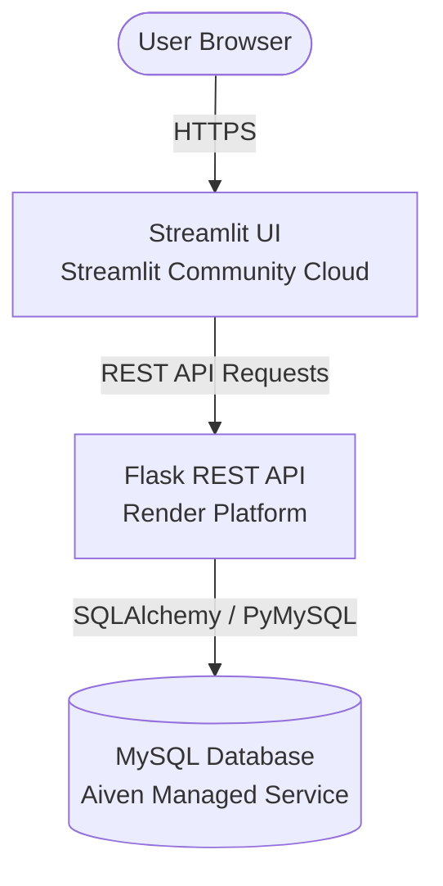

# 🏢 Employee Management System (EMS)

A deployment-ready, cloud-native Employee Management System featuring a **Flask REST API** backend, a **Streamlit UI** frontend, and **MySQL** database integration.

---

## 🏗️ Architecture Overview



- **Frontend**: Streamlit (Hosted on Streamlit Community Cloud)
- **Backend API**: Flask + Flask-RESTX + Gunicorn (Hosted on Render)
- **Database**: Managed MySQL (Hosted on Aiven Cloud)

---

## 🚀 Local Development Setup

### 1. Prerequisites
- Python 3.9+
- MySQL Server running locally (or Aiven MySQL instance)

### 2. Installation
1. Clone the repository:
   ```bash
   git clone <your-repository-url>
   cd Employee
   ```

2. Create and activate a virtual environment:
   ```bash
   python -m venv venv
   # On Windows:
   venv\Scripts\activate
   # On macOS/Linux:
   source venv/bin/activate
   ```

3. Install production dependencies:
   ```bash
   pip install -r requirements.txt
   ```

4. Configure environment variables:
   Copy `.env.example` to `.env` and fill in your local MySQL details:
   ```env
   DB_HOST=localhost
   DB_USER=root
   DB_PASSWORD=your_password
   DB_NAME=employee_management
   DB_PORT=3306
   DB_SSL=false
   SECRET_KEY=dev-secret-key-123
   ```

### 3. Running Locally
- **Option A (Simultaneous launch using run.py):**
  ```bash
  python run.py
  ```

- **Option B (Separate processes):**
  - **Start Flask REST API:**
    ```bash
    python app.py
    ```
    *API will run on `http://127.0.0.1:5001/api/v1` and Swagger docs at `http://127.0.0.1:5001/swagger`*

  - **Start Streamlit Frontend:**
    ```bash
    streamlit run streamlit_app.py
    ```
    *Frontend will launch on `http://localhost:8501`*

---

## ☁️ Deployment Guide

### Step 1: Managed MySQL on Aiven
1. Sign up at [Aiven.io](https://aiven.io).
2. Create a new **MySQL** service.
3. Once running, copy your database connection details (Host, Port, User, Password, Database Name, or Service URI).
4. Create the target database `employee_management` via Aiven Console or MySQL Workbench.

### Step 2: Flask REST API on Render
1. Push your code to GitHub.
2. Sign up at [Render.com](https://render.com).
3. Click **New +** → **Web Service**.
4. Connect your GitHub repository.
5. Configure settings:
   - **Environment**: Python 3
   - **Build Command**: `pip install -r requirements.txt`
   - **Start Command**: `gunicorn app:app`
6. Add Environment Variables on Render:
   - `DATABASE_URL`: `mysql+pymysql://<user>:<password>@<host>:<port>/<dbname>?ssl_mode=REQUIRED`
   - `SECRET_KEY`: `<generate-a-strong-secret-key>`
   - `FLASK_ENV`: `production`
7. Click **Deploy Web Service**. Copy your live Render service URL (e.g., `https://ems-api.onrender.com`).

### Step 3: Streamlit UI on Streamlit Community Cloud
1. Sign up at [share.streamlit.io](https://share.streamlit.io).
2. Click **New App** and select your GitHub repository.
3. Main file path: `streamlit_app.py`.
4. Click **Advanced settings** -> **Secrets**:
   ```toml
   API_BASE_URL = "https://ems-api.onrender.com/api/v1"
   ```
5. Click **Deploy!**

---

## 🎓 Streamlit Learning Concepts Included

This codebase is structured to serve as an interactive textbook for building Streamlit apps:

1. **st.set_page_config()** (`streamlit_app.py`):
   - Sets page layout to wide mode, browser title, and sidebar state before any UI elements load.

2. **st.session_state & requests.Session** (`frontend_services/api_client.py`):
   - Preserves user login state and HTTP cookies across Streamlit reruns without losing context.

3. **st.columns() & st.metric()** (`frontend_views/dashboard.py`):
   - Creates modern horizontal KPI cards with quantitative deltas and custom styling.

4. **st.tabs() & st.form()** (`frontend_views/employees.py`):
   - `st.tabs()` organizes dense UI sections neatly.
   - `st.form()` batches input widgets so Streamlit doesn't rerun on every keystroke, firing API calls only when `st.form_submit_button()` is clicked.

5. **st.file_uploader() & st.download_button()** (`frontend_views/employees.py`):
   - Handles binary file streams directly inside Streamlit for CSV imports and PDF downloads.

6. **Custom CSS with st.markdown()** (`streamlit_app.py`):
   - Injects clean CSS styles to give the dashboard a polished corporate aesthetic.
